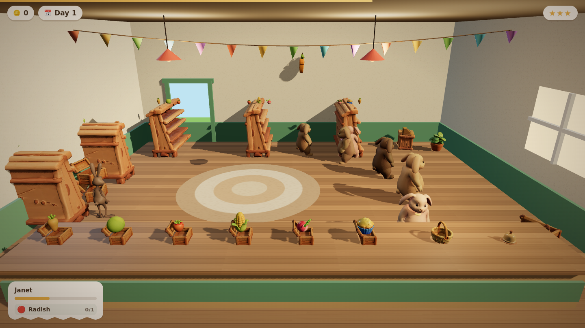
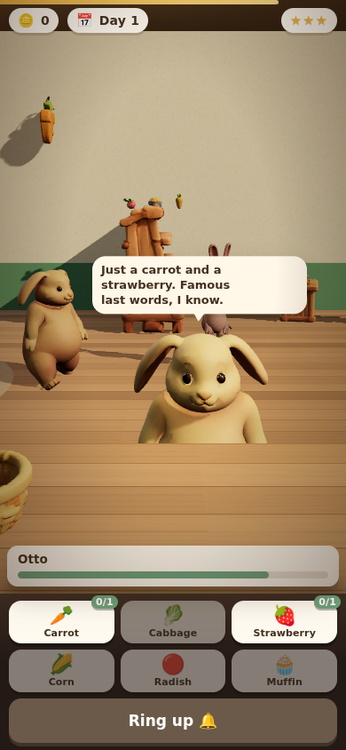

# Hop & Shop

A very small grocery for very demanding rabbits.

Rabbits hop in off the meadow, loiter by the shelves having a quiet crisis about
cabbage, and eventually queue at your counter. Read the order, click the crates
to bag the produce, ring the brass bell, take their money. They are not patient.
You can pet them, which helps.



It plays on a phone. Upright, the camera closes in on whoever is at the counter
and the produce moves to a control pad under the shop, because no camera can fit
a ten-metre counter into a portrait frame and no thumb can hit a crate the size
of a thumbnail.



Every model in `assets/` — the rabbits, their walk cycles, the produce, the
fixtures — was generated with the Tripo text-to-3D API and is rebuildable from
`tools/assets.config.mjs`.

## Playing

Serve the folder and open `index.html`. There is no build step.

```
python3 -m http.server 8000     # or any static server
```

- **Click a crate** on the counter — or tap the produce on the pad — to put one
  of that item in the bag. Number keys `1`–`6` do the same.
- **Ring the bell** (or press space) to close the sale. Ringing early is free,
  but the rabbit will comment.
- **Click a rabbit** to pet it. Worth seven seconds of patience, once each.
- Bagging the wrong thing costs patience and part of the tip.
- Flawless sales in a row build a **streak**, and the streak multiplies the tip.
  One mistake ends it.
- Three rabbits leaving unhappy and the warren stops coming.

Every so often something happens to the whole shop for half a minute — a run on
cabbage, a rumour about the radishes, an unusually generous hour, the 3:15 bus
arriving all at once. Each one is a real modifier, not just a banner: crazes
push an item into every order, rumours take one out, and the tips, patience and
arrival rate move with them.

Days get busier: shorter gaps between customers, longer orders, less patience.
Three customers are not like the others:

| who | from | the bit |
| --- | --- | --- |
| A Normal Adult Rabbit | day 2 | Three rabbits in a trench coat. Orders three rabbits' worth, insists it is a normal amount for one rabbit. |
| A Very Small Rabbit | day 2 | Orders exactly one thing, has planned it all week, is very hard to upset, tips in buttons. |
| Warren Health Inspector | day 3 | Wants one of three different things and is timing you. Serve it flawlessly and you get a lost star back. |

## How it is put together

```
index.html            entry point and the HUD markup
src/
  config.js           shop geometry, stock list and every tuning number
  scene.js            renderer, room, lighting, prop placement
  assets.js           GLB loading, and normalising whatever the generator sent
  bunny.js            one customer: rig, clips, walking, the trench coat stack
  game.js             the rules — spawning, queueing, orders, scoring, events
  dialogue.js         everything the rabbits say
  ui.js / ui.css      HUD, tickets, speech bubbles and the touch pad
  audio.js            synthesised sound; no audio files
vendor/three/         pinned three.js runtime, so the folder runs offline
assets/               generated models (committed) and the task ledger
tools/                asset pipeline, optimiser, capture and tests
```

Two decisions are load-bearing:

**The room is built, the contents are generated.** Walls, floor, counter run and
rug are primitives with canvas textures. Text-to-3D is very good at a cabbage
and very bad at a flat wall, and stretching a generated counter across the shop
smeared its cash register into a puddle — so the counter is joinery and the
generated one became a back counter where its detail is visible.

**The game owns position, the clips own the pose.** Tripo's baked animations
carry a little residual root travel; `bunny.js` strips horizontal motion from
the root track and keeps the vertical bounce, so walking is driven by the game
and the hop still looks like a hop.

**Screen shape picks the composition.** The visible vertical span of a
perspective camera is `2 * halfHeight / aspect` whatever the field of view, so
no single camera suits a phone upright, a laptop and a phone on its side.
`frameCamera` in `scene.js` blends between hand-tuned stops — described by the
half-height each wants to see, since wasted vertical space is what makes a
framing look wrong — and solves the camera distance from that. Below 760px wide
or 520px tall, or on any coarse pointer, the canvas also gives up its bottom
edge to a control pad rather than having one float on top of the shop.

**Nothing walks through the furniture.** Rabbits are pushed out of every solid
prop's real footprint each frame, along whichever axis they are least far into
it, and out of each other. That is a safety net rather than the plan — the walk
targets are placed with clearance — but it means a badly placed waypoint can
never park a rabbit inside a counter. It replaced a layout built on guessed
footprints: the shelf model is 2.68m deep, nothing like the size it looks, which
had put two queue positions and three loitering spots inside shelves and a whole
shelf across the doorway.

## Rebuilding the assets

Needs `TRIPO_API_KEY`.

```
npm install
npm run assets:list      # what exists, what would be generated, and the balance
npm run assets           # generate anything missing
npm run optimize         # strip and recompress — 50MB of GLB down to 5MB
```

The pipeline keys a ledger (`assets/ledger/<name>.json`) off a hash of each
step's request, so re-running is free and editing one prompt rebuilds only that
asset. Rigging and animation are chained off the generated mesh automatically:
`text_to_model` → `animate_rig` → one `animate_retarget` per clip.

`tools/optimize.mjs` does most of the size work. Each animation export ships a
full duplicate of the rabbit — mesh, skeleton and 2K textures — when the game
only wants the clip, and animation tracks address nodes by name, so the meshes
and textures can be deleted outright. Originals are kept in `assets/raw/`
(gitignored) and the optimiser always works from those.

## One file

`npm run bundle` writes the whole shop — three.js, the game, the stylesheet and
every model — into a single HTML file under `dist/`, with no external requests
at all.

```
npm run bundle
# dist/hop-and-shop.html   a complete document, openable from disk
# dist/artifact.html       the same page minus <html>/<head>/<body>, for hosts
#                          that supply their own document skeleton
```

Models are embedded as base64 and handed to `GLTFLoader.parse` rather than
fetched. That is not quite enough on its own: `GLTFLoader` turns each embedded
texture into a `blob:` URL and then loads that URL, which is a network request
as far as a content policy is concerned. The bytes are already in memory, so
`src/assets.js` registers a plugin that decodes them with `createImageBitmap`
directly. The finished page issues exactly one request — for itself — and so
runs under a policy that blocks every scheme, `blob:` and `data:` included.

The bundle is about 7.5MB and is not committed; `dist/` is ignored.

## Tests

```
npm test                 # 44 assertions over the actual game rules
npm run collisions       # ten unattended minutes, reporting anything walked into
npm run shot             # a screenshot of the shop
```

`tools/playtest.mjs` steps the simulation directly rather than waiting on
wall-clock time, so a full day of trading takes about a second and the results
are deterministic. It covers a clean sale end to end, wrong items, petting,
patience running out, the day rolling over, losing, restarting, streaks, each
special customer's rules, the touch pad's counts, every shop-wide event's
modifier, that nobody ends up inside the furniture or inside another rabbit,
that a long line gets a long bubble, and four unattended minutes without the
shop floor filling up.

`tools/collisions.mjs` runs the shop unattended and samples every rabbit's
walking circle against every prop's measured footprint, printing which prop, how
often, how deep and during which phase of a visit. Grazing at zero depth is the
separation pass working; anything deeper fails the run.

`tools/shot.mjs` serves the folder, drives a headless browser and exits non-zero
on any page error, so it doubles as a smoke test. Useful flags:

```
node tools/shot.mjs --out shots/a.png --sim 30          # fast-forward 30s of game time
node tools/shot.mjs --out shots/b.png --cam 2.6,2.3,6.2 --look 2.8,1,1.3
node tools/shot.mjs --out shots/c.png --eval "window.__game.day = 5"
node tools/shot.mjs --out shots/d.png --play 25000      # random clicking
node tools/shot.mjs --page dist/hop-and-shop.html --out shots/e.png --sim 30
node tools/shot.mjs --out shots/f.png --w 390 --h 844 --touch --sim 20   # phone
```

`--touch` makes Chromium report a coarse pointer. Without it a phone-sized
window still gets the desktop layout, which is exactly the bug it exists to
catch.

`--sim` exists because software rendering runs at a few frames a second, and the
frame loop clamps `dt`, so waiting ten real seconds advances the game by about
one. Stepping the simulation directly sidesteps that entirely.
