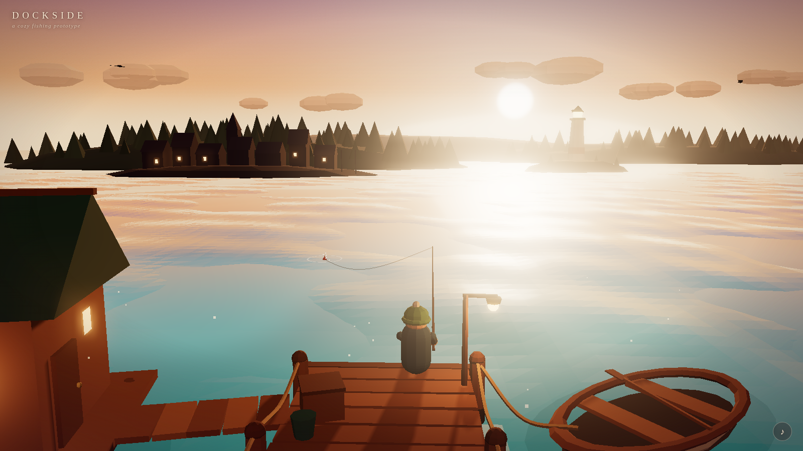

# Dockside — a cozy fishing prototype

A small playable three.js scene: golden hour on a wooden dock, teal water,
a tied-up rowboat, a hut with a glowing window, village silhouettes and a
lighthouse on the horizon. Click the water to cast; when the bobber plunges,
click again.



## Run it

No build step, no network dependencies (three.js r170 is vendored).
Serve the folder with any static server:

```sh
npx http-server cozy-fishing        # or: python3 -m http.server
```

and open the printed URL. That's it.

**Controls** — move the mouse to lean the camera; click open water to cast;
click while the bobber plunges (the `!`) to hook the fish; click during the
wait to reel in early. `♪` toggles sound.

## Structure

```
index.html            importmap + DOM overlay skeleton
src/
  config.js           ← the whole mood: palette, sun, waves, camera, bloom, pacing
  main.js             bootstrap + the one update loop
  core/
    stage.js          renderer, camera rig (sway + parallax), bloom/output post chain
    utils.js          lerp/damp/ease/seeded rng
  shaders/chunks.js   wave field + skyColor(), shared by GPU (glsl) and CPU (js)
  scene/
    sky.js            gradient dome + sun disc (bloom does the rest)
    water.js          faceted water shader: sky reflection, sun glints, shore mottling
    lighting.js       low warm sun + hemisphere + fill, fog
    effects.js        pooled ripples/splashes/sparkles, motes, smoke, light streaks
  props/
    registry.js       placeholder registry + swapModel() for real assets
    parts.js          the low-poly part kit everything is built from
    dock.js hut.js boat.js fisher.js background.js fish.js
    index.js          set dressing: spawns and places every piece
  systems/
    fishing.js        the state machine: IDLE→CASTING→FLY→WAIT→BITE→CATCH/ESCAPE→REEL
    feedback.js       DOM toast / hint / tally / "!" marker
    audio.js          lazy WebAudio: surf loop, plips, catch chime
tools/shot.mjs        headless capture + smoke test (playwright)
vendor/three/         pinned three.js 0.170.0 + bloom passes
```

## Tuning the mood

Everything atmospheric is a constant in `src/config.js` — palette, sun
direction, wave set, fog range, bloom, camera framing, bite pacing. The sky
gradient and the water read from the same `skyColor()` chunk, and the fog
carries the same sun-halo terms, so shifting the palette shifts the whole
hour coherently. The wave constants are injected into the shader *and*
mirrored in JS, so floating props always agree with the drawn water.

## Dropping in real models

Every set piece is a named placeholder spawned through `props/registry.js`.
To replace one with a real model, keep its name and the swap keeps its
transform and runtime hooks:

```js
import { swapModel } from './src/props/registry.js';
const gltf = await new GLTFLoader().loadAsync('models/boat.glb');
swapModel(scene, 'boat', gltf.scene);
```

Placeholder anchor conventions:

| name         | origin / orientation                                        |
|--------------|-------------------------------------------------------------|
| `dock`       | water level; deck top y=1.0; runs z=+6 → −12.4, half-width 1.6 |
| `hut`        | platform center at water level; local +x faces the dock     |
| `boat`       | group is world-space; bobbing hull child ~4.7 × 2.2         |
| `fisher`     | seat level on the deck, facing −z; keeps `userData.api` (rodTip, playCast, setBite) on swap |
| `background` | scenery group at scene origin — purely decorative           |

Fish are built per-species in `props/fish.js` (`buildFish`), with the catch
table (`SPECIES`) alongside — weights, stars, colors, flavor lines.

## Verifying headlessly

```sh
node tools/shot.mjs --out shots \
  --script "wait:2500,shot:arrival,click:0.45x0.62,wait:5000,eval:window.__dockside.forceBite(),wait:600,shot:bite"
```

Steps: `wait:<ms>`, `shot:<name>`, `click:<fx>x<fy>` (viewport fractions),
`eval:<js>`. `window.__dockside` exposes `state`, `caught`, `forceBite()`
and `castAt(x, z)` for scripted runs. The tool exits non-zero on any page
error, so it doubles as a smoke test. Note: headless software WebGL runs
slowly and the simulation clamps dt, so allow generous waits.
