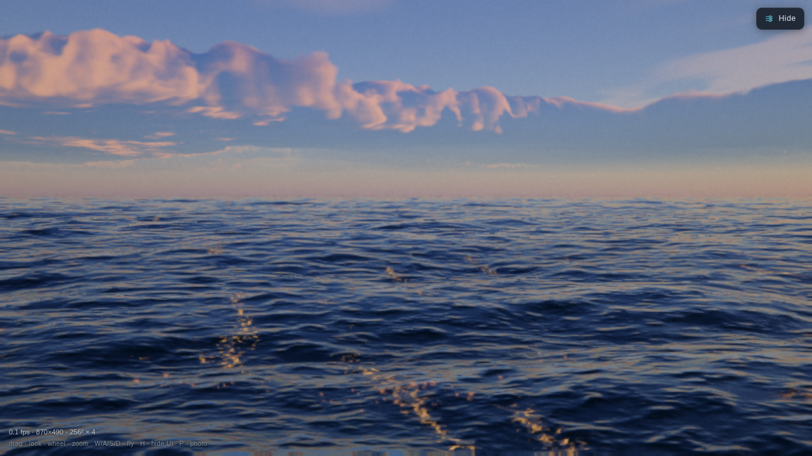
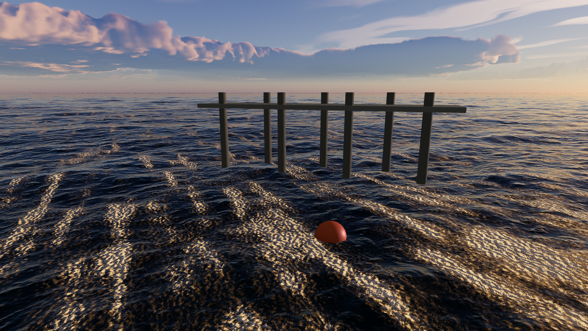

<div align="center">

# Abyssal

**A photoreal ocean and sky for WebGL2 — droppable into a Three.js scene.**

[Three.js guide](docs/threejs.md) · [Parameters](docs/parameters.md) · [How it works](docs/physics.md) · [Examples](examples/)



</div>

A real-time sea built from a multi-cascade FFT wave spectrum, and a sky built from
a physical atmosphere with a volumetric cloud raymarch. Both are self-contained
WebGL2 components with no dependencies, and either can be used on its own.

```js
import { AbyssalWater, AbyssalSky } from 'abyssal-ocean/three';

const sky   = new AbyssalSky(renderer, { preset: 'Golden Hour Swell' });
const water = new AbyssalWater(renderer, { params: sky.params, sky });

// in your loop, with renderer.autoClear = false
water.update(dt, camera);
sky.update(dt, camera);
renderer.clear();
water.render(camera);            // sea first — writes depth
renderer.render(scene, camera);  // your objects, occluded by the real waves
sky.render(camera);              // sky last — only shades what is left
```

<div align="center">



*`examples/water-and-sky.html` — the pilings and deck are ordinary
`THREE.Mesh`es. The waterline moves across them because the sea and your scene
share one depth buffer.*

</div>

---

## Install

```
npm install abyssal-ocean
```

No dependencies, and no `three` peer dependency — the adapter never imports
Three, it reads three matrices off the camera you hand it. Any Three from r120
works, via bundler, import map or CDN.

WebGL2 and `EXT_color_buffer_float` are required.

## What you get

**The sea.** A wave spectrum sampled over four cascades at non-commensurate patch
sizes, so the surface has no visible tiling period. Choppy (Lagrangian)
displacement for sharp crests, filtered slope variance driving roughness so
distant water goes rough instead of aliasing, exact dielectric Fresnel, physical
subsurface scattering, and two populations of foam — fresh crest foam and the
thinning raft it decays into.

**The sky.** A raymarched atmosphere with multiple-scattering, and volumetric
clouds on spherical shells: a weather field for coverage and cloud type, a
vertical density profile, cone-traced lighting with powder and silver-lining
terms, and an analytic multiple-scattering tail.

**Extras**, exported but optional: `Spray` (GPU particle spray for a moving hull),
`Wake` (a persistent Kelvin wake that remembers where you have been), and `Post`
(HDR bloom, auto-exposure, tonemap, grain).

Eight presets, from `Glassy Dawn` through `North Atlantic Storm` to `Moonlit
Passage`, and about 380 parameters — all of it plain-object state you can read
and write.

## Using it

- **[docs/threejs.md](docs/threejs.md)** — the integration guide. Render order,
  colour management, and an explicit list of what does and does not integrate.
- **[docs/parameters.md](docs/parameters.md)** — every knob, its default and its
  range. Generated from the source.
- **[docs/physics.md](docs/physics.md)** — the models and where they come from,
  if you want to know why it looks the way it does.

Without Three.js, the same pieces are available directly:

```js
import { Ocean, Sky, WaterSurface, newParams } from 'abyssal-ocean';

const ocean = new Ocean(gl, { size: 256 });   // the wave fields
const sky = new Sky(gl, blit);                // atmosphere + clouds
const surface = new WaterSurface(gl, params); // the camera-centred sea grid
```

`Ocean` owns the wave *fields* and knows nothing about a camera; `WaterSurface`
owns the *view* of them. If you want the geometry under your own material, use
`Ocean` alone.

## The demo

The repository also contains **Abyssal** itself: a full cinematic ocean simulator
with a rideable wave runner, spray, wake, photo mode and a live control panel for
every parameter.

```
npm install
npm start                # http://localhost:8080
```

Keys: `W/A/S/D` fly · `R` ride · `V` view · `P` photo · `H` hide panel.

## Layout

```
src/          the library — no DOM, no dependencies, nothing global
  ocean.js      FFT wave simulation (the fields)
  water.js      the sea surface (the view of them)
  sky.js        atmosphere + volumetric clouds
  spray.js      GPU particle spray        } optional
  wake.js       persistent Kelvin wake    }
  post.js       HDR post chain            }
  three/        the Three.js adapter
  shaders/      GLSL, as plain strings
demo/         the Abyssal application — UI, camera, wave runner, craft
examples/     minimal Three.js integrations
tools/        build, capture and measurement scripts
```

## Development

```
npm start                # serve the demo and the examples
npm run build            # single self-contained HTML file in dist/
npm run check            # headless smoke test of the demo
npm run check:examples   # headless smoke test of the Three.js examples
npm run docs:params      # regenerate docs/parameters.md
```

`tools/shot.mjs` and `tools/check-examples.mjs` exit non-zero on any WebGL or JS
error, and also on a frame that came out uniform — a broken shared-context
integration usually produces a blank frame rather than an exception.

## Known gaps

- **CPU-side wave height / buoyancy is not exposed.** The wave field lives in GPU
  textures and reading it back needs an asynchronous probe. The demo has a working
  one in `demo/waverunner.js`; it is not yet a general API. This is the top of
  the list.
- **Clouds render at full resolution.** Half-res with a depth-aware upsample is
  the obvious win and is not done; the march is about a fifth of a frame.
- Three's fog, shadow maps and tone mapping do not reach the sea or the sky. See
  [docs/threejs.md](docs/threejs.md#what-integrates-and-what-does-not).

## Licence

MIT — see [LICENSE](LICENSE).

The wave-runner model used by the demo (`demo/craftModel.js`) was generated with
Meshy.ai under a paid plan carrying commercial use rights. The published library
contains no third-party assets.
