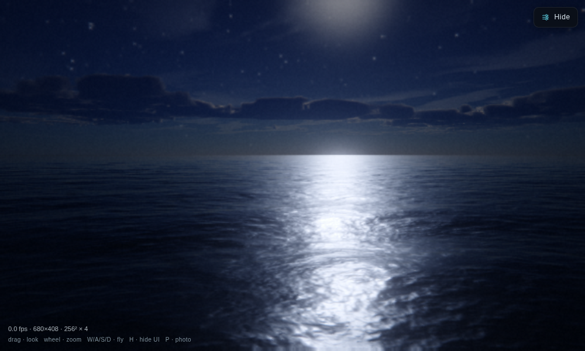

<div align="center">

# Abyssal

**A photoreal ocean and sky for Three.js — WebGPU with WebGL2 fallback.**

[Three.js guide](docs/threejs.md) · [Parameters](docs/parameters.md) · [How it works](docs/physics.md) · [Examples](examples/) · [For coding agents](AGENTS.md)


</div>

A real-time sea built from a multi-cascade FFT wave spectrum, and a sky built from
a physical atmosphere with a volumetric cloud raymarch. The whole stack is written
once in TSL, three.js's node shading language, so the same source compiles to
WGSL on WebGPU and to GLSL on WebGL2, and the backend is a runtime choice —
every pass is verified pixel-identical between the two against golden images.

```js
import * as THREE from 'three/webgpu';
import { createAbyssal } from 'abyssal-ocean/webgpu';

const abyssal = await createAbyssal({
  canvas,
  preset: 'Golden Hour Swell',
  scene,                    // your THREE.Scene — shares the frame's depth
});

const camera = new THREE.PerspectiveCamera(55, innerWidth / innerHeight, 0.5, 40000);
abyssal.renderer.setAnimationLoop(() => abyssal.frame(camera));
```

That is the entire integration: FFT ocean, volumetric sky, spray and a filmic
HDR post chain on the canvas, WebGPU when the machine has it, WebGL2 when it
does not. Your meshes occlude the water and the waterline rides across your
hull, because your scene and the sea share one depth buffer.

The sky's clouds come as **real genera** — measured recipes, not just coverage
values with names (see [`src/cloud-types.js`](src/cloud-types.js)):

```js
abyssal.setClouds('cumulonimbus');   // or cirrus, cumulus, stratus, nimbus
abyssal.setClouds('nimbus');         // the light stays the preset's; only the clouds change
```

`water: false` gives you the sky alone over your own ground; `post: false`
leaves linear HDR for your own tonemapper. `examples/webgpu-ocean.html` and
`examples/webgpu-sky.html` are copy-paste starting points.

## The classic WebGL2 adapter

The original components are still here and still dependency-free — three reads
matrices off the camera you hand it and never imports `three` itself:

```js
import { AbyssalWater, AbyssalSky } from 'abyssal-ocean/three';

const sky   = new AbyssalSky(renderer, { preset: 'Golden Hour Swell' });
const water = new AbyssalWater(renderer, { params: sky.params, sky });

// in your loop, with renderer.autoClear = false
water.update(dt, camera);
sky.update(dt, camera);
renderer.clear();
water.render(camera);            // sea first — writes depth
renderer.render(scene, camera);  // your objects, occluded by the real waves
sky.render(camera);              // sky last — only shades what is left
```

<div align="center">


*`examples/water-and-sky.html` — the pilings and deck are ordinary
`THREE.Mesh`es. The waterline moves across them because the sea and your scene
share one depth buffer.*

</div>

---

## Install

```
npm install abyssal-ocean
```

The `abyssal-ocean/webgpu` entry imports `three/webgpu` and needs three ≥ r185
(an optional peer dependency). Everything else — the classic adapter and the
raw components — has no dependencies at all: the adapter never imports Three,
it reads three matrices off the camera you hand it, and any Three from r120
works, via bundler, import map or CDN.

For the classic path, WebGL2 and `EXT_color_buffer_float` are required.

## What you get

**The sea.** A wave spectrum sampled over four cascades at non-commensurate patch
sizes, so the surface has no visible tiling period. Choppy (Lagrangian)
displacement for sharp crests, filtered slope variance driving roughness so
distant water goes rough instead of aliasing, exact dielectric Fresnel, physical
subsurface scattering, and two populations of foam — fresh crest foam and the
thinning raft it decays into.

**The sky.** A raymarched atmosphere with multiple-scattering, and volumetric
clouds on spherical shells: a weather field for coverage and cloud type, a
vertical density profile, cone-traced lighting with powder and silver-lining
terms, and an analytic multiple-scattering tail.

**Extras**, exported but optional: `Spray` (GPU particle spray for a moving hull),
`Wake` (a persistent Kelvin wake that remembers where you have been), and `Post`
(HDR bloom, auto-exposure, tonemap).



Eleven presets, from `Glassy Dawn` through `Tropical Lagoon` (a shallow bed you
can see through) and `North Atlantic Storm` to `Peaceful Moonlit Ocean` (above),
and about 380 parameters — all of it plain-object state you can read and write.

## Using it

- **[docs/threejs.md](docs/threejs.md)** — the integration guide. Render order,
  colour management, and an explicit list of what does and does not integrate.
- **[docs/parameters.md](docs/parameters.md)** — every knob, its default and its
  range. Generated from the source.
- **[docs/physics.md](docs/physics.md)** — the models and where they come from,
  if you want to know why it looks the way it does.

Without Three.js, the same pieces are available directly:

```js
import { Ocean, Sky, WaterSurface, newParams } from 'abyssal-ocean';

const ocean = new Ocean(gl, { size: 256 });   // the wave fields
const sky = new Sky(gl, blit);                // atmosphere + clouds
const surface = new WaterSurface(gl, params); // the camera-centred sea grid
```

`Ocean` owns the wave *fields* and knows nothing about a camera; `WaterSurface`
owns the *view* of them. If you want the geometry under your own material, use
`Ocean` alone.

## The demo

The repository also contains **Abyssal** itself: a full cinematic ocean simulator
with a rideable wave runner, spray, wake, photo mode and a live control panel for
every parameter.

```
npm install
npm start                # http://localhost:8080
```

Keys: `W/A/S/D` fly · `R` ride · `V` view · `P` photo · `H` hide panel.

## Layout

```
src/          the library — no DOM, no dependencies, nothing global
  ocean.js      FFT wave simulation (the fields)
  water.js      the sea surface (the view of them)
  sky.js        atmosphere + volumetric clouds
  spray.js      GPU particle spray        } optional
  wake.js       persistent Kelvin wake    }
  post.js       HDR post chain            }
  cloud-types.js  the five real cloud genera, as measured recipes
  three/        the Three.js adapter (classic WebGL2)
  gpu/          the TSL port — one source, WGSL and GLSL
    abyssal.js    createAbyssal(), the one-call facade
    tsl/          node-graph drivers: sim, water, sky, spray, post
  shaders/      GLSL, as plain strings
demo/         the Abyssal application — UI, camera, wave runner, craft
examples/     minimal Three.js integrations
tools/        build, capture and measurement scripts
```

## Development

```
npm start                # serve the demo and the examples
npm run build            # single self-contained HTML file in dist/ (WebGL2 demo)
npm run build:three      # the three.js/WebGPU demo bundle
npm run check            # headless smoke test of the demo
npm run check:bundle:three  # build + smoke test the three.js/WebGPU bundle
npm run check:examples   # headless smoke test of the Three.js examples
npm run docs:params      # regenerate docs/parameters.md
```

`tools/shot.mjs` and `tools/check-examples.mjs` exit non-zero on any WebGL or JS
error, and also on a frame that came out uniform — a broken shared-context
integration usually produces a blank frame rather than an exception.

## Known gaps

- **Ride / fly / swim controllers are still demo-only.** Any mesh can already
  plane or float via `abyssal.bodies.add` (spread `SKI` for the ski numbers) —
  see [`examples/webgpu-box-ski.html`](examples/webgpu-box-ski.html). The ride
  HUD has not been moved off `WaveRunner` yet.
- **Clouds render at full resolution.** Half-res with a depth-aware upsample is
  the obvious win and is not done; the march is about a fifth of a frame.
- Three's fog, shadow maps and tone mapping do not reach the sea or the sky. See
  [docs/threejs.md](docs/threejs.md#what-integrates-and-what-does-not).

## Licence

MIT — see [LICENSE](LICENSE).

The wave-runner model used by the demo (`demo/craftModel.js`) was generated with
Meshy.ai under a paid plan carrying commercial use rights. The published library
contains no third-party assets.
